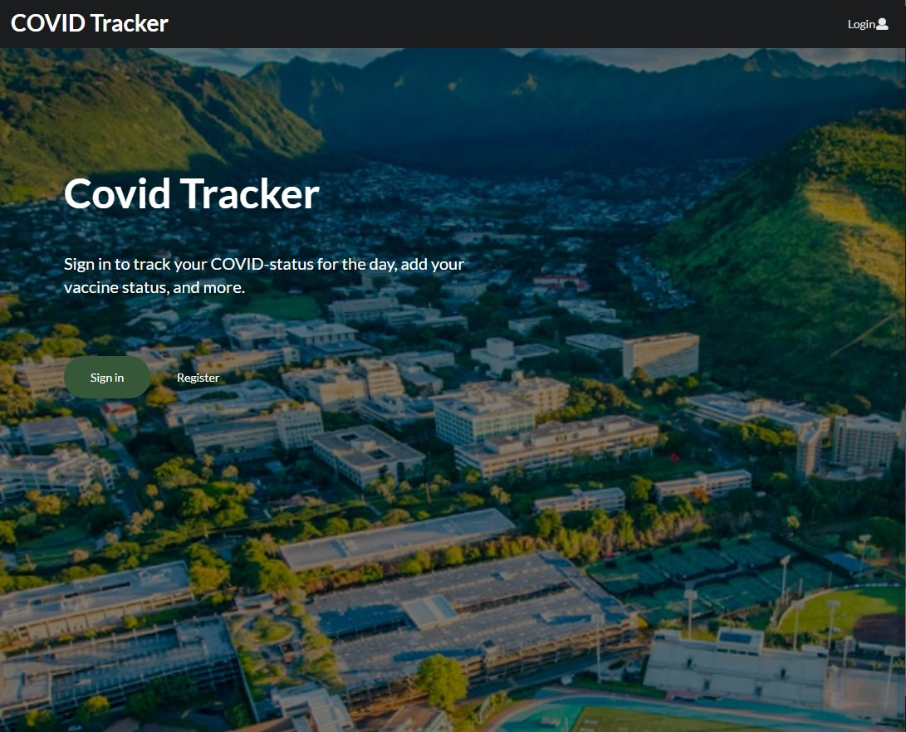
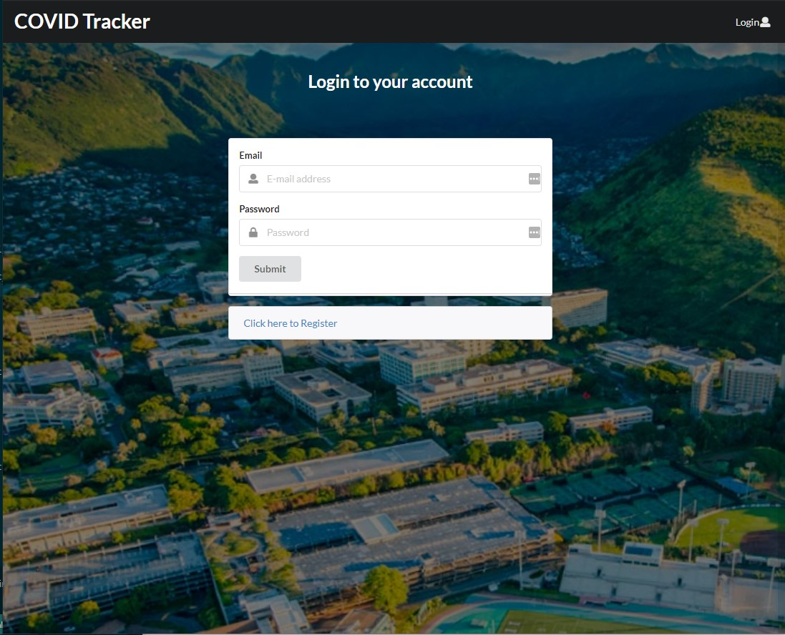
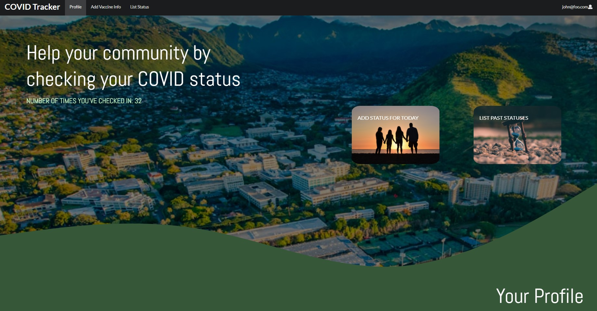
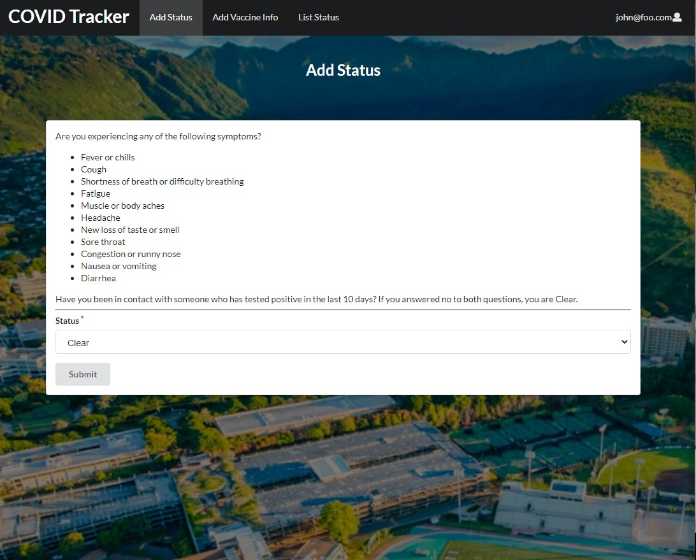
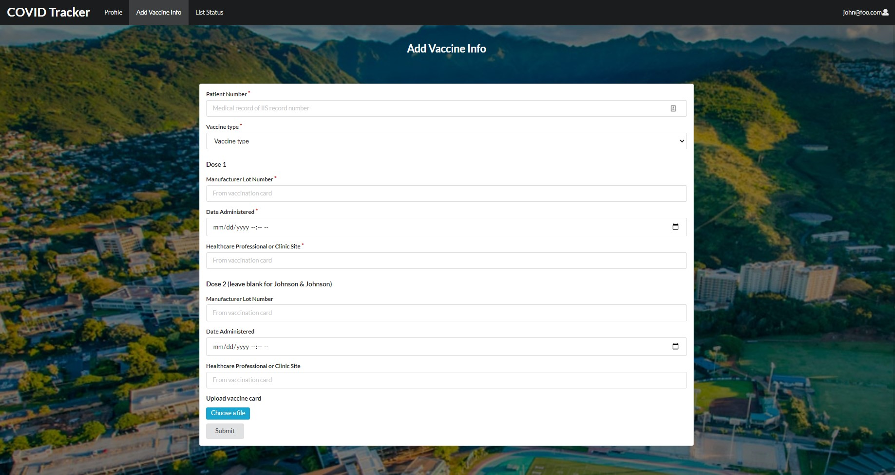
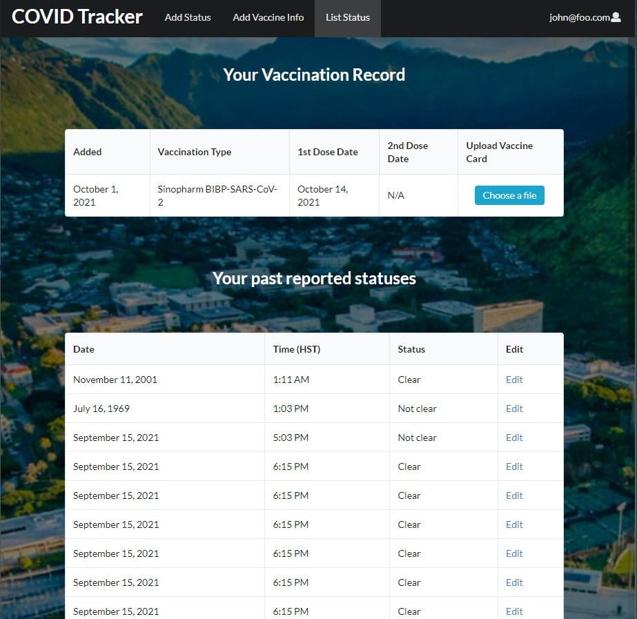
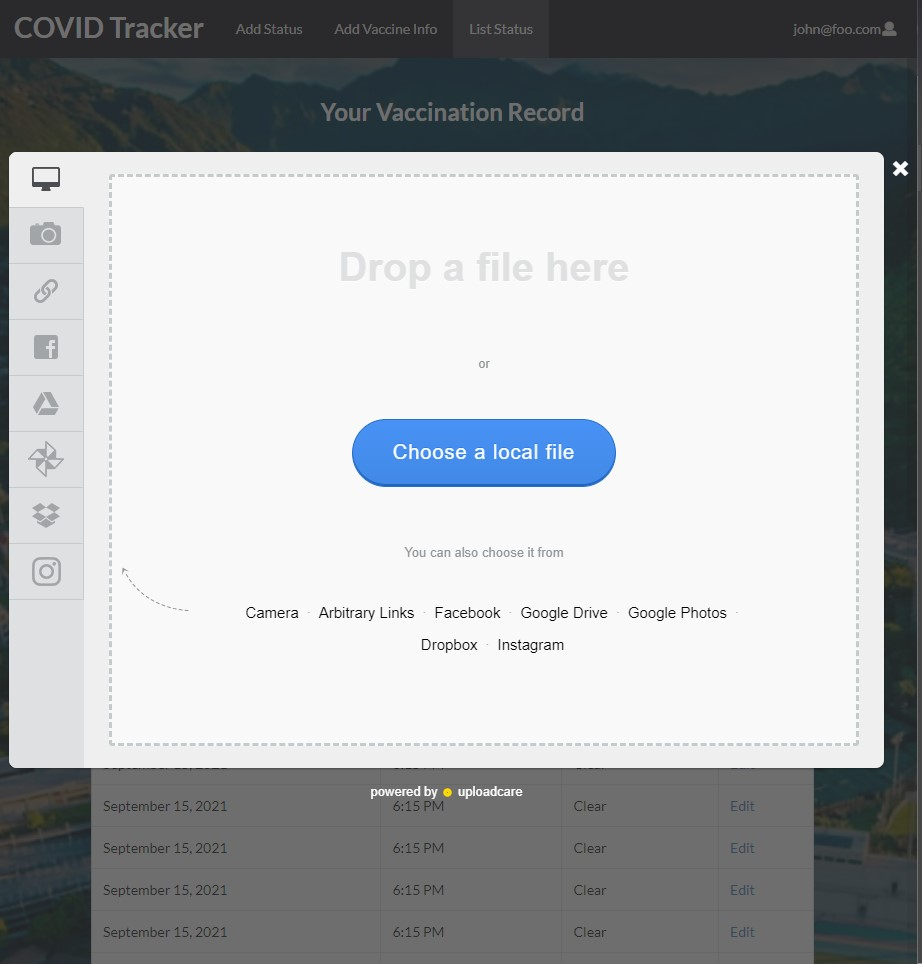

<!-- Covid Tracker -->

## Table of contents

* [Overview](#overview)
* [Team Members](#team-members)
* [Landing](#landing)
* [Sign-in/Register](#sign-in--register)
* [List COVID Status](#list-covid-status)
* [Add COVID Status](#add-covid-status)

## Overview

Introductory project for ICS 491 to help us warm up our tech stack in preparation for two upcoming hackathons. This project is an implementation of a COVID symptom and vaccination status tracking app. The current build of the app is available at [https://covid-tracker.meteorapp.com/](https://covid-tracker.meteorapp.com/)

## Team Members

* [Mujtaba Quadri](https://github.com/mujtaba-a-quadri)
* [Alyssia Chen](https://github.com/alyssia-chen)
* [Jolie Ching](https://github.com/jolieching)
* [Dylan Decker](https://github.com/dylandecker)

## Landing

This page serves as the main landing for the website.
From here, the user can either sign in or register. At the moment, the "sign-in" and "register" buttons are not responsive yet, but the "login" button in the top right is functional.

## Sign-In / Register

To unlock full functionality of the app, the user must sign-in to the page with their credentials.
If they do not have an account, they will have the ability to register for one.

## Profile Page
A dashboard of sorts, the profile page provides the user convenient ways to add their status and list previous statuses. More personalization may be implemented in the future (e.g. name, date, number of times the user has checked in).

## Add COVID Status

With this COVID Tracker application, the user has the option to add their COVID Status for the day using the form. The user only needs to indicate if their status is "clear" or "not clear" and then the application will automatically record the date and time on submission of the form.

## Add Vaccine Status

Here, the user can input information about their vaccination record, including patient number, vaccine type and manufacturer lot number, date administered, & healthcare professional or clinic site per dose. 

## List COVID Status

With this COVID Tracker application, the user has the option to list their previous COVID Statuses. Additionally, the user can edit all inputted statuses, but we may limit this functionality in the future to only the current day. 

Additionally, the user has the ability to add an image of their vaccine card. They will be prompted with the following window when they click "choose a file":

The user has the option to upload images from their computer, a URL, their Google Drive, and much more - how convenient!!

