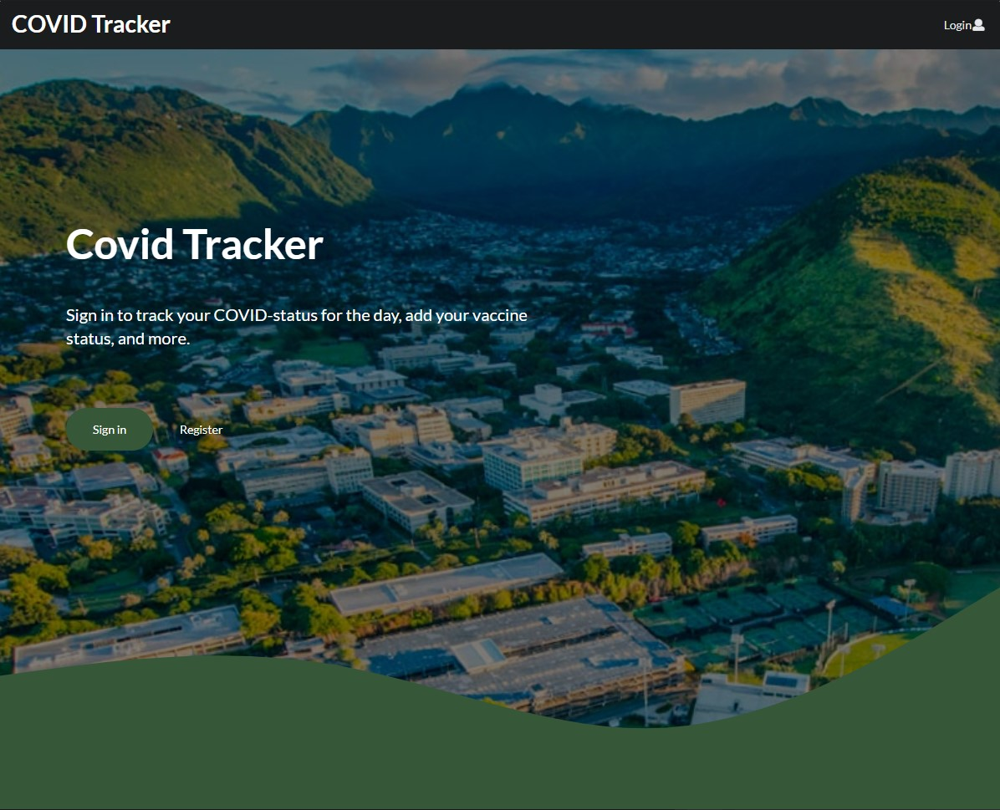
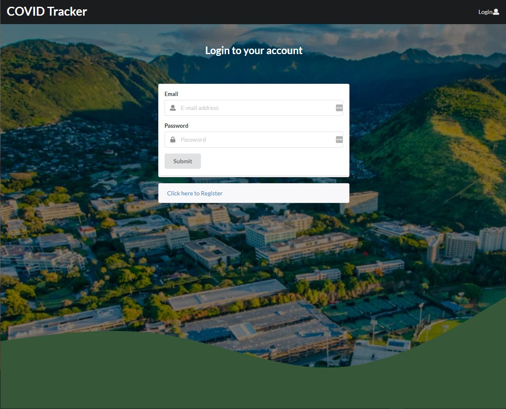
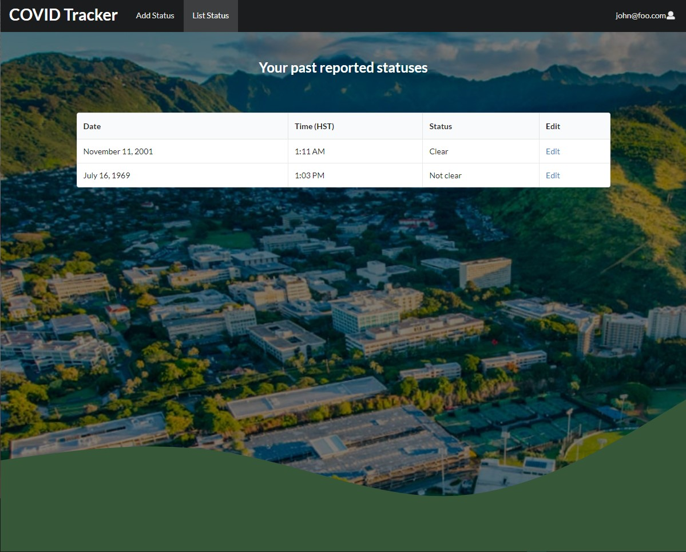
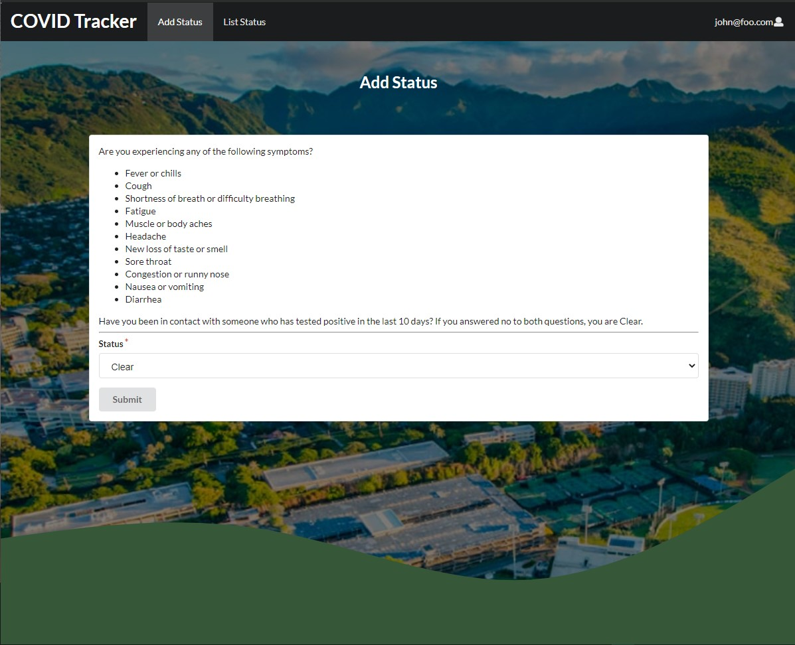

<!-- Covid Tracker -->

## Table of contents

* [Overview](#overview)
* [Team Members](#team-members)
* [Sign-in/Register](#sign-in--register)
* [Profile Overview](#profile-overview)
* [List COVID Status](#list-covid-status)
* [Add COVID Status](#add-covid-status)

## Overview

Introductory project for ICS 491. An implementation of a COVID symptom and vaccination status tracking app. The current build of the app is available at [https://covid-tracker.meteorapp.com/](https://covid-tracker.meteorapp.com/)

## Team Members

* [Mujtaba Quadri](https://github.com/mujtaba-a-quadri)
* [Alyssia Chen](https://github.com/alyssia-chen)
* [Jolie Ching](https://github.com/jolieching)
* [Dylan Decker](https://github.com/dylandecker)

## Landing

This page serves as the main landing for the website.
From here, the user can either sign in or register.

## Sign-In / Register

To unlock full functionality of the app, the user must sign-in to the page with their credentials.
If they do not have an account, they will have the ability to register for one.

## List COVID Status

With this COVID Tracker application, the user has the option to list their previous COVID Statuses.

## Add COVID Status

With this COVID Tracker application, the user has the option to add their COVID Status for the day.

